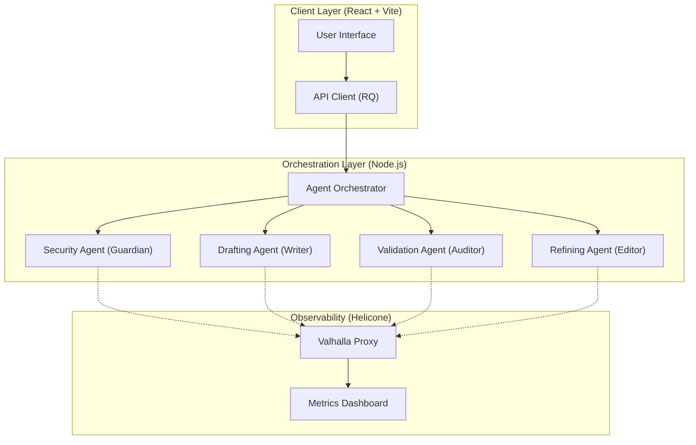
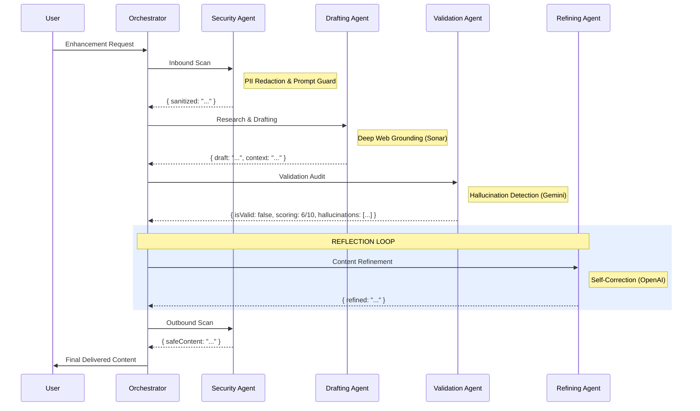

# GhostPost 👻

GhostPost is an **Agentic AI** content enhancement platform. It transforms raw thoughts and web articles into high-authority, viral-ready content through a coordinated **Multi-Agent Orchestration** system.

Built with a **provider-agnostic**, **whitelabeled** architecture, GhostPost ensures elite-level content generation with built-in security guardrails and deep observability.

---

## 🚀 Key Features

- **Multi-Agent Orchestration**: A sophisticated pipeline involving specialized agents for Security, Drafting, Validation, and Refinement.
- **Self-Correcting Content Loop**: The system automatically fact-checks and polishes drafts through a reflection (Validation -> Refining) cycle.
- **Deep Research capability**: Integrated real-time web search for grounding content in current data and statistics.
- **Helicone Observability**: Native integration with self-hosted Helicone for granular request tracing, latency monitoring, and token tracking.
- **Security Guardrails**: Multi-layered security scanning (Inbound & Outbound) for PII redaction, toxicity filtering, and prompt injection protection.
- **Professional Exports**: One-click downloads as **Word (DOCX)** or **PDF** with high-premium typography.

---

## 🏗 System Architecture

GhostPost utilizes a modular, role-based architecture designed for flexibility and scalability.



---

## 🔀 Multi-Agent Pipeline

Every content enhancement request passes through a strictly coordinated sequence of specialized AI workers.



## 🕵️ Agent Handoff Trace Protocol

Every enhancement request generates a granular `trace` object for observability.

| Step | Agent | Status Token | Data Responsibility |
| :--- | :--- | :--- | :--- |
| 1 | `SecurityAgent` | `inbound_complete` | Sanitizes user input and detects injections. |
| 2 | `DraftingAgent` | `drafting_complete` | Generates research-backed content via Perplexity. |
| 3 | `ValidationAgent` | `validation_complete` | Audits for hallucinations and structural quality. |
| 4 | `RefiningAgent` | `refinement_complete` | Corrects unverified claims (if triggered by low score). |
| 5 | `SecurityAgent` | `outbound_complete` | Final safety check and PII redaction of output. |

---

## 🛠 Tech Stack

### Frontend
- **React 18 & Vite**: For high-performance UI.
- **Tailwind CSS**: Modern, premium design tokens and utilities.
- **React Query**: Robust server-side state management.
- **DOCX / JSPDF**: Professional document generation.

### Backend
- **Node.js & Express**: Specialized service-oriented architecture.
- **Multi-Agent System**: Provider-agnostic agent worker classes.
- **Standard LLM Provider**: High-performance generation.
- **Audit LLM Provider**: Fact-checking and grounding.
- **Research Engine**: Real-time web-grounded data retrieval.
- **Helicone**: Integrated observability proxy.
- **ClickHouse & PostgreSQL**: Advanced analytics and storage.

---

## 🚀 Getting Started

### 1. Configure Environment
Update `backend/.env` with your role-based API keys:
```env
SECURITY_API_KEY=...
DRAFTING_API_KEY=...
VALIDATION_API_KEY=...
```

### 2. Start Observability (Optional)
Launch the self-hosted Helicone stack:
```bash
docker-compose -f helicone-compose.yml up -d
```
Access the dashboard at `http://localhost:3000`.

### 3. Start Application
```bash
# In backend/
npm run dev

# In frontend/
npm run dev
```

---

## 🔐 Engineering Principles

1. **SOLID Architecture**: Strict separation between Agent logic (prompts/state) and Provider infrastructure (API clients).
2. **Provider Agnostic**: The system is entirely whitelabeled. Switching AI models involves zero changes to core business logic.
3. **Agentic AI Patterns**: Implements Reflection, Self-Correction, and Tool-use (Research) patterns.
4. **DRY & Modular**: Centralized prompt hub and role-based configuration.
5. **Zero-Leak Policy**: Strictly no `console.log` statements in production/UI paths for enhanced security and clean debugging.
