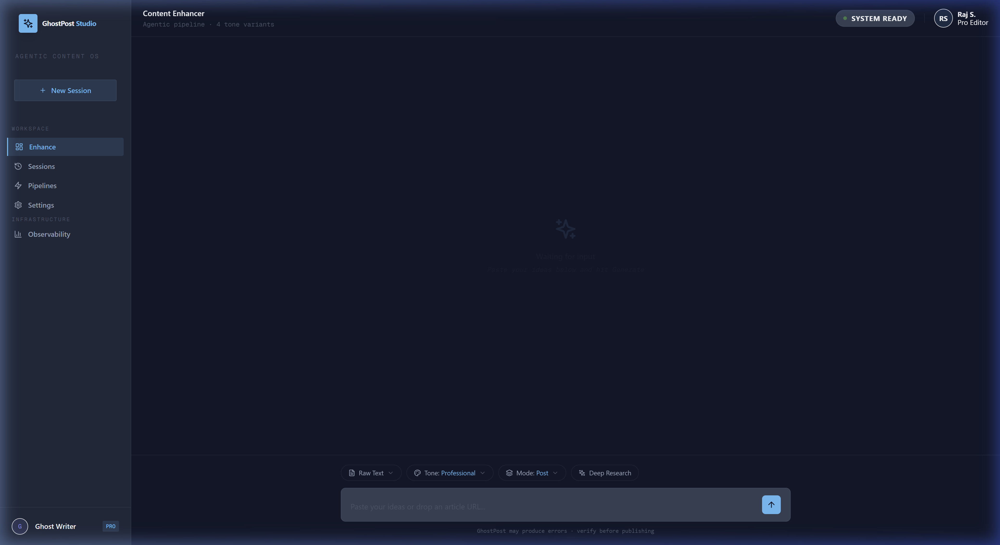
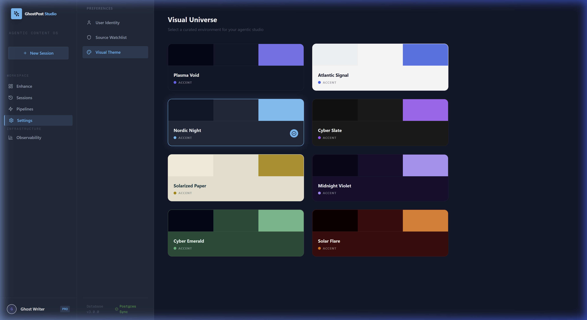

# GhostPost Studio 👻
### The Elite Multi-Agent Content OS

GhostPost is a high-fidelity, agentic environment designed for technical writers, content strategists, and ghostwriters. It transforms raw research and ideas into polished, high-authority articles through a **Parallel Intelligence** orchestration layer.



## 🌌 The Visual Experience
Experience your workspace in 8 curated **Visual Universes**. Whether you're in the deep-space focus of *Plasma Void* or the high-energy glow of *Solar Flare*, the studio conforms to your creative state.



## 🧠 Core Intelligence Architecture
GhostPost utilizes a sophisticated multi-agent system where specialized brains work in parallel to ensure precision, security, and quality.

- **Guardian Agent**: Multi-layered security scanning for PII redaction and prompt injection protection.
- **Sonar Research**: Real-time web-grounded data retrieval for factual accuracy.
- **Auditor Agent**: Parallel factual validation and hallucination detection.
- **Refinement Agent**: Self-correcting reflection loops for high-quality output.

## 📖 Documentation Vault
Explore the deep technical and functional details of the studio:

- 🏛️ **[Technical Architecture](docs/ARCHITECTURE.md)**: Diagrams of the Parallel Intelligence layer, database schema, and observability patterns.
- 📰 **[Functional Guide](docs/FEATURES.md)**: Illustrated guide to Content Enhancement, The Newsroom, and Watchlist management.
- 🎨 **[UI System & Design Tokens](docs/UI_SYSTEM.md)**: Deep-dive into the Theme-Reactive Token System and HSL Universe definitions.

## 🚀 Quick Start (Development)

### 1. Prerequisites
- Docker & Docker Compose
- Node.js 20+

### 2. Environment Setup
Create a `.env` file in the root based on `.env.example` and add your API keys:
- `OPENAI_API_KEY`
- `PERPLEXITY_API_KEY` (For Sonar Research)

### 3. Launch
```bash
docker-compose up -d
```
The studio will be available at [http://localhost:5173](http://localhost:5173).

---
*Built with React 18, Vite, Node.js, Prisma, PostgreSQL, and ClickHouse.*
