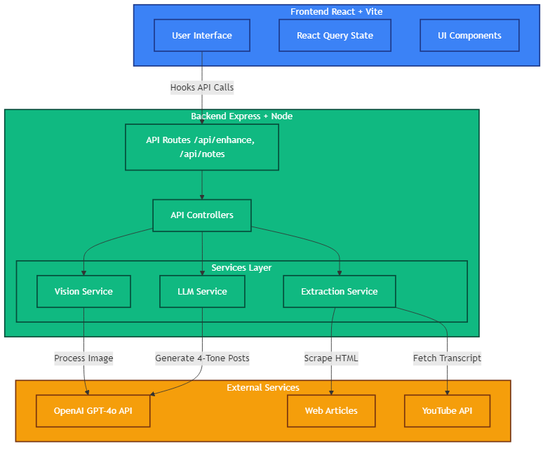
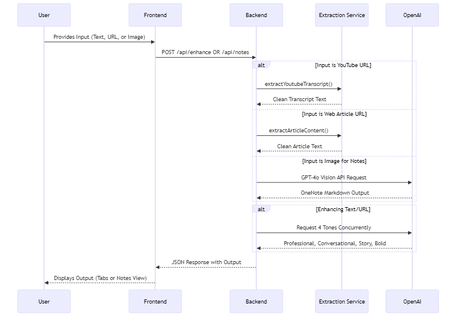
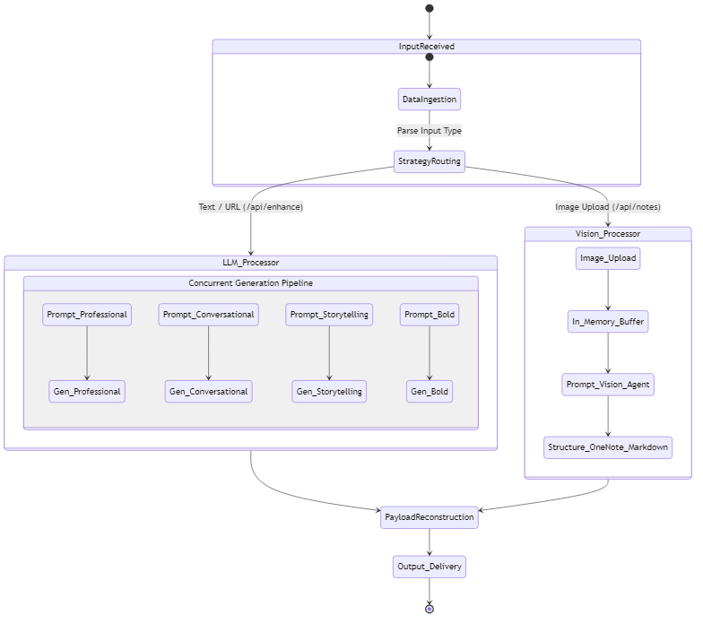

# GhostPost 👻

GhostPost is an AI-powered content enhancement platform designed to transform raw thoughts, messy notes, web articles, YouTube videos, and even handwritten images into viral-ready, high-quality content. It acts as an elite ghostwriter, instantly generating structured outputs ranging from multi-tone LinkedIn posts to OneNote-ready notebooks.

## 🚀 Features

- **Detailed Article Mode**: Generate comprehensive, multi-page articles (up to 10 pages) with structured headers and deep insights.
- **Deep Research Capability**: Integrated with **Perplexity Sonar** for real-time web research, fact-gathering, and statistical integration into your articles.
- **Professional Exports**: One-click downloads as **Word (DOCX)** or **PDF**. Our custom parser strips raw markdown tags and applies premium typography for a "publish-ready" look.
- **Multi-Tone Generation**: Generates 4 distinct variations (Professional, Conversational, Storytelling, and Bold/Contrarian) of your post concurrently.
- **Web Article Extraction**: Paste a URL, and the app automatically scrapes and parses the article text layout.
- **YouTube Transcript Extraction**: Paste a YouTube video link, and the app automatically fetches the raw closed-caption transcript to summarize/enhance.
- **Security First**: Enforces SSRF blocks on URL fetching, robust in-memory file handling, and rate-limiting.

---

## 🏗 Architectural Diagram

The application follows a robust client-server architecture with separation of concerns via a service-oriented backend.

---

## 🔀 Data Flow Diagram

Visualizes the lifecycle of a user request from input to the final UI rendering. 

---

## 🤖 Agentic Diagram (Internal Logic Flow)

This diagram shows how the backend routes inputs dynamically and utilizes agentic design patterns to build the resulting outputs asynchronously.

---

## 🛠 Tech Stack

**Frontend:**
- **React.js (v18)** + **Vite**: Blazing fast UI rendering and hot module reloading.
- **Tailwind CSS**: Utility-first CSS framework for a premium, glassmorphism design.
- **React Hook Form** & **Zod**: Form validation and type safety.
- **React Query**: Asynchronous state management and caching.
- **docx**, **jspdf** & **file-saver**: Powering professional document exports with markdown-to-styling conversion.
- **Lucide React**: Clean, modern icons.

**Backend:**
- **Node.js** + **Express.js**: Lightweight HTTP server.
- **TypeScript**: End-to-end type safety.
- **OpenAI (GPT-4o)**: Powers the professional LLM tone generation.
- **Gemini (2.0 Flash)**: High-speed, cost-effective Vision OCR engine for notes digitizing.
- **Perplexity (Sonar)**: Powers real-time search-grounded research and fact-gathering.
- **Axios & Cheerio**: Headless HTML scraping and parsing.
- **Pino**: High-performance JSON logging and request tracing.

---

## 📖 Complete Walkthrough

### 1. The Enhance Post Feature
- **Goal:** Turn messy thoughts or external links into structured LinkedIn posts.
- **Usage:** 
  1. Open the **Enhance Post** tab.
  2. Select your Input Type (Raw Text, Web Article URL, or YouTube Video URL).
  3. Paste the content or URL.
  4. Click `Enhance Post`.
  5. The backend parses the data (extracting website text or YouTube captions) and fans out the generation to OpenAI, requesting 4 separate stylistic variants simultaneously.
  6. **Pro Exports**: Download your favorite variant as a **Professional Word Document** or **Modern PDF**. No more copying raw markdown — our system delivers clean, formatted files instantly.

### 2. The Notes Feature
- **Goal:** Quickly digitize handwritten notes, mind maps, or screenshots into editable Microsoft OneNote text.
- **Usage:**
  1. Open the **Notes** tab from the left sidebar.
  2. Drag and drop a valid image file (JPEG, PNG, WebP — max 5MB).
  3. The image is uploaded securely into backend memory and pushed to **Gemini 2.0 Flash Vision**.
  4. The AI (transcribed by Google's latest multimodal models) intelligently structures the text using bold headers, bullet points, and proper spacing.
  5. The UI renders the result in a clean Markdown area, ready to be copy-pasted directly into OneNote.

---

## 🔐 Security & Optimization Principles applied

1. **SOLID Principles:** The `enhance.controller` utilizes the Open-Closed Principle via a Strategy map dictionary for dynamically choosing extraction methods based on the `inputType`.
2. **DRY (Don't Repeat Yourself):** Replaced 4 repetitive block requests to OpenAI with a clean `.map()` over a `tones` array using `Promise.all` mapping.
3. **In-Memory Buffering:** Uploaded pictures are never written to the disk. They are held in memory streams and garbage collected, minimizing disk IO and security footprints.
4. **SSRF Protections:** Web scraping endpoints strictly parse and block internal, local, or AWS metadata domains (e.g., `localhost`, `169.254.169.254`). 
5. **Observability:** Centralized `requestTracer.ts` and `Pino` logging track latency, durations, and asynchronous errors to make scaling and debugging seamless.
