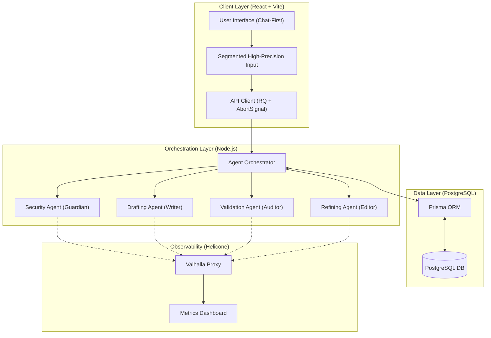
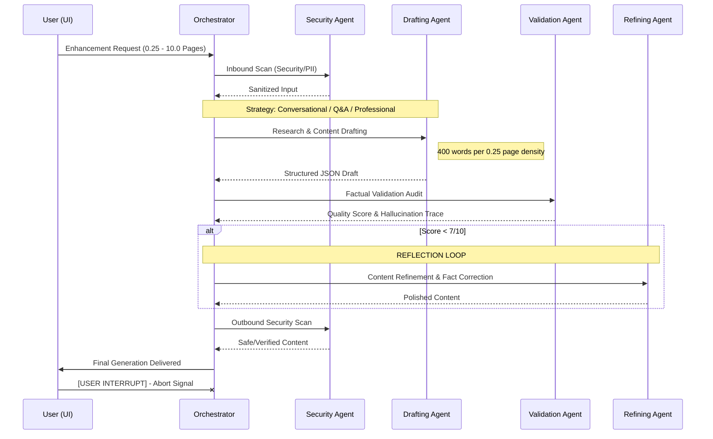

# GhostPost 👻

GhostPost is an **Agentic AI** content enhancement platform. It transforms raw thoughts and web articles into high-authority, viral-ready content through a coordinated **Multi-Agent Orchestration** system.

Built with a **provider-agnostic**, **whitelabeled** architecture, GhostPost ensures elite-level content generation with built-in security guardrails and deep observability.

---

## 🚀 Key Features

- **Multi-Agent Orchestration**: A sophisticated pipeline involving specialized agents for Security, Drafting, Validation, and Refinement.
- **Conversational Q&A Pattern**: A specialized "interactive dialogue" mode that structures content as a 2-person casual chat with a fixed topic and deep-dive discussion.
- **High-Precision Length Control**: Supports **0.25-page increments** with a surgical density of **400 words per quarter-page**.
- **Self-Correcting Content Loop**: The system automatically fact-checks and polishes drafts through a reflection (Validation -> Refining) cycle.
- **Interruptible Pipeline**: Real-time "Stop Generation" capability using AbortSignal to physically terminate active agent tasks.
- **Deep Research capability**: Integrated real-time web search (Sonar) for grounding content in current data and statistics.
- **Helicone Observability**: Native integration for granular request tracing, latency monitoring, and token tracking.
- **Security Guardrails**: Multi-layered security scanning for PII redaction and prompt injection protection.

---

## 🏗 System Architecture

GhostPost utilizes a modular, role-based architecture designed for flexibility and scalability.

---

## 🔀 Multi-Agent Interaction Flow

Every content enhancement request passes through a strictly coordinated sequence of specialized AI workers.

---

## 💾 Persistence & Data Strategy

GhostPost uses a robust data layer to ensure observability and persistence of the agentic workflow.

- **PostgreSQL**: Chosen for transactional integrity. Every agent handoff, confidence score, and generated post is stored as a structured record.
- **Prisma ORM**: Provides a type-safe bridge between the Node.js orchestrator and the database, ensuring that agent traces are strictly validated before storage.
- **Why Persistence?**: 
    - **Observability**: Tracking how individual agents (like the Auditor) impact final content quality over time.
    - **History**: Allowing users to retrieve and export previous generations without re-running the expensive agent pipeline.

---

## 🕵️ Agent Handoff Trace Protocol

| Step | Agent | Responsibility | Logic Pattern |
| :--- | :--- | :--- | :--- |
| 1 | `Security` | PII Redaction & Inbound Shield | Guardrail |
| 2 | `Drafting` | Research & Content Production | Generation / Tool-Use |
| 3 | `Validation` | Factual Audit & Hallucination Check | Reflection |
| 4 | `Refining` | Error Correction & Tone Matching | Self-Correction |
| 5 | `Security` | Final Output Verification | Guardrail |

---

## 🛠 Tech Stack

### Frontend
- **React 18 & Vite**: Chat-model UI with relative-floating controls.
- **Tailwind CSS**: High-premium design tokens with no-waste headers.
- **Segmented Input**: Custom "Int . Dec" logic for surgical formatting.

### Backend
- **Node.js (TypeScript)**: Specialized multi-agent service layer.
- **Prisma**: Type-safe data modeling.
- **LLM Orchestration**: Provider-agnostic agent worker classes.

---

## 🔐 Engineering Principles

1. **SOLID & DRY**: Strict separation between Agent logic (prompts) and Provider infrastructure.
2. **Agentic AI Patterns**: Fully implements **Reflection**, **Self-Correction**, and **Multi-Agent Collaboration**.
3. **Zero-Leak Security**: No `console.log` statements in production; strict PII redaction by the Guardian Agent.
4. **Network Resilience**: Full support for `AbortSignal` for real-time task termination.

---

*Built with ❤️ by the GhostPost Engineering Team.*
