# Technical Architecture - GhostPost 👻

GhostPost is built on a modular, asynchronous architecture designed for high-precision content generation and deep observability.

## 🧠 Multi-Agent Parallel Intelligence

Unlike traditional linear pipelines, GhostPost utilizes **Parallel Intelligence** during its validation and refinement phase. This reduces total latency by executing independent auditing tasks simultaneously.

```mermaid
sequenceDiagram
    participant U as UI / Controller
    participant O as Orchestrator
    participant S as Security Agent
    participant D as Drafting Agent
    participant V as Validation Agent
    participant H as Hook Agent
    participant R as Refining Agent

    U->>O: Raw Input
    Note over U,O: Intent Utility (Auto-Routing)
    
    O->>S: [1] Inbound Security Scan
    S-->>O: Sanitized Input
    
    alt isTopic (Input < 500 chars)
        O->>D: [2a] Deep Web Research (Sonar)
    end

    O->>D: [2b] Drafting (Few-Shot Prompts)
    D-->>O: Raw JSON Draft
    
    Note over O,H: PARALLEL INTELLIGENCE BLOCK
    rect rgb(15, 23, 42)
    par Validation & Hook Refinement
        O->>V: [3a] Factual & Human-Flow Audit
        Note over V: Drops score if AI-isms/Hyphens detected
        V-->>O: Quality Score & Hallucination Trace
    and
        O->>H: [3b] Hook Strategy Optimization
        H-->>O: Refined Attention Hooks
    end
    end

    alt Quality Score < 7
        O->>R: [4] Reflection & Punctuation Scrubbing
        R-->>O: Polished Content
    end

    O->>S: [5] Outbound Security Verification
    S-->>O: Final Safe Output
```

## 🧠 Advanced Prompt Engineering
- **Few-Shot Drafting**: The Drafting Agent utilizes injected examples of "Good Human Text" and "Bad AI Text" to structurally map its output.
- **Dynamic Validation Templates**: The Validation Agent dynamically restructures its system prompt on the fly. If no web research context is provided, it drops strict hallucination rules to prevent false-positive content deletion.
- **Active Human-Flow Policing**: The Validation Agent acts as an aggressive editor, actively scanning for hyphenated compound words (e.g. "fast-paced") and em dashes. If detected, it forces the Orchestrator to reject the draft.
- **Surgical Refinement**: The Refining Agent acts as the "Fixer", explicitly instructed to scrub out AI-isms and re-pace the text using standard commas.

## 🛠 Tech Stack Deep-Dive

### 1. Persistence Layer
- **PostgreSQL**: Stores the master state of all research topics, sessions, and generated articles.
- **Prisma ORM**: Located in `infrastructure/database/`, providing type-safe access to your Postgres instance.
- **ClickHouse**: Used for high-volume **Agent Handoff Traces**. Every micro-action taken by an agent is logged for long-term pattern analysis.

### 2. Observability & Tracing
- **Helicone Integration**: Every LLM request is proxied through Helicone for granular token tracking and latency monitoring.
- **Child-Logger Pattern**: Each agent uses a context-aware child logger that automatically injects the `requestId` into every log pulse, allowing for perfect "session stitching."

### 3. Resilience Patterns
- **Retry Logic**: All agent tasks use an exponential backoff retry mechanism to survive transient API failures (429/503).
- **Interruptible Streams**: Full support for `AbortController` at every layer, allowing users to physically terminate remote agent tasks instantly.
