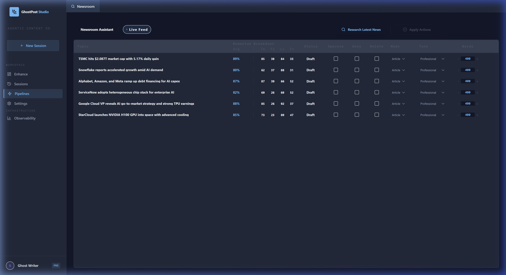

# Functional Guide - GhostPost Studio 🤖

GhostPost is an Elite Agentic Content OS designed to transform raw ideas into high-authority articles and viral social media posts.

## 🚀 1. Content Enhancer
The primary interface for high-precision content generation.

### Key Capabilities:
- **Precision Length Control**: Generate content in increments of 0.25 pages (approx. 400 words per quarter-page).
- **Tone Orchestration**: Choose from 8+ professional personas including *Provocative*, *Academic*, *Conversational*, and *Inspirational*.
- **Deep Research**: Toggle "Deep Research" to trigger the **Sonar Agent**, which performs real-time web-grounded research via Perplexity.

---

## 🌌 2. The Visual Universe
GhostPost is not just a tool; it's a curated environment. The **Visual Universe** allows you to switch between 8 pre-designed aesthetic "worlds."

### Available Universes:
- **Plasma Void**: A high-contrast, deep-space aesthetic with violet accents.
- **Cyber Emerald**: A matrix-inspired, high-productivity green environment.
- **Atlantic Signal**: A professional, clean, high-clarity blue theme.
- **Solar Flare**: A warm, high-energy orange palette for creative bursts.

---

## 📰 3. The Newsroom Assistant
The automated pipeline that scans your "Watchlist" to find trending topics and market shifts.

### Workflow:
1. **Watchlist Scan**: Automatically monitors specific companies or sectors.
2. **Momentum Scoring**: Assigns a "Trend Score" based on real-time news velocity.
3. **Drafting Queue**: One-click "Apply Actions" to move a trending topic directly into the drafting pipeline.

---

## 🛡️ 4. Security & Governance
Every word generated is scanned by the **Guardian Agent**.
- **PII Redaction**: Automatic masking of emails and phone numbers.
- **Prompt Protection**: Real-time detection of injection attacks or "DAN mode" attempts.
- **Factual Confidence**: Every article includes a factual confidence score and source citations.
